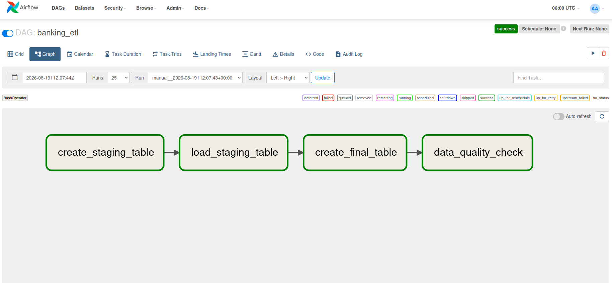

# Banking Airflow ETL Pipeline

A simple Data Engineering project that demonstrates an ETL workflow using **Apache Airflow** and **Apache Hive**.

The pipeline loads raw banking transaction data into a staging table, transforms and validates the data, stores the cleaned result in a final Hive table, and performs a basic data quality check.

## Pipeline



The Airflow DAG contains four tasks:

```text
create_staging_table
        ↓
load_staging_table
        ↓
create_final_table
        ↓
data_quality_check
```

### 1. Create Staging Table

Creates the Hive staging table used to receive the raw transaction data.

```text
raw CSV → stg_transactions
```

### 2. Load Staging Table

Loads the raw banking CSV data into the staging table.

Example input fields:

```text
transaction_id
customer_id
account_id
amount
status
city
channel
```

### 3. Create Final Table

Transforms and validates the staging data before loading it into the final table.

Example validation rules:

* `transaction_id` must not be NULL
* `account_id` must not be NULL
* `amount` must be greater than 0
* `channel` must be one of:

  * MOBILE
  * ATM
  * BRANCH

The final table is stored using **Parquet** for more efficient analytical queries.

```text
stg_transactions
       ↓
Validation / Transformation
       ↓
final_transactions
```

### 4. Data Quality Check

Runs a validation query against the final table to confirm that records were successfully processed.

## Architecture

```text
Raw Banking CSV
       ↓
Apache Airflow
       ↓
Hive Staging Table
       ↓
Transformation & Validation
       ↓
Hive Final Table
       ↓
Data Quality Check
```

## Technologies

* Apache Airflow
* Apache Hive
* Hadoop / HDFS
* Docker
* PostgreSQL
* Python
* Parquet
* Linux

## Project Structure

```text
banking-airflow-etl/
├── banking_etl.py
├── docker-compose.yml
├── README.md
├── images/
│   └── airflow_pipeline.png
└── data/
    └── raw/
        └── raw20260819.csv
```

## Running the Pipeline

Start the required services:

```bash
docker compose up -d
```

Check that the Airflow DAG is available:

```bash
docker exec airflow airflow dags list | grep banking_etl
```

Trigger the pipeline:

```bash
docker exec airflow airflow dags trigger banking_etl
```

Check the DAG run status:

```bash
docker exec airflow airflow dags list-runs -d banking_etl
```

## Hive Validation

Enter the Hive container:

```bash
docker exec -it hive-server bash
```

Connect using Beeline:

```bash
beeline -u jdbc:hive2://localhost:10000
```

Then query the generated tables:

```sql
USE banking;

SHOW TABLES;

SELECT COUNT(*)
FROM stg_transactions;

SELECT COUNT(*)
FROM final_transactions;

SELECT *
FROM final_transactions
LIMIT 10;
```

## Result

The Airflow workflow successfully orchestrates the banking ETL process from raw data ingestion through staging, transformation, final storage, and data quality validation.
